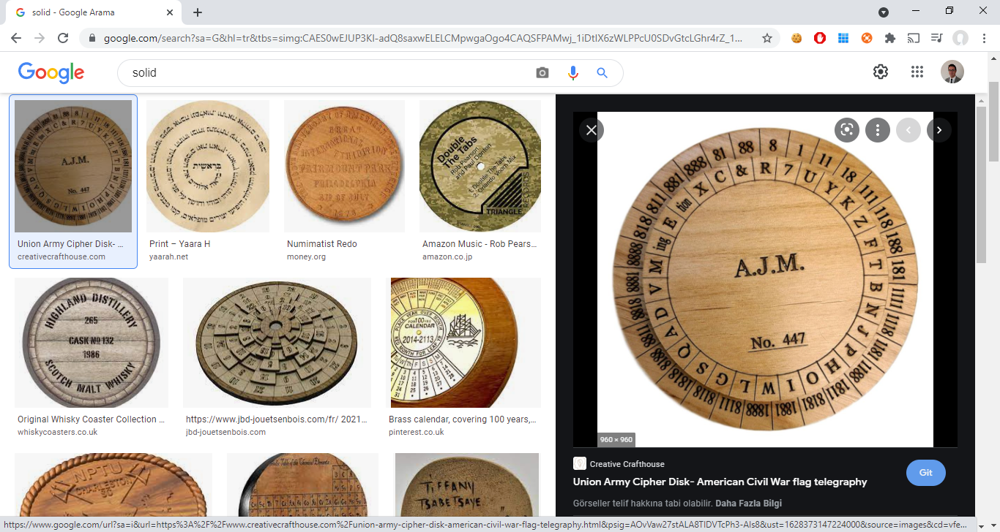
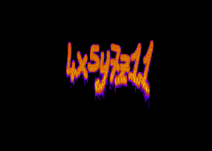
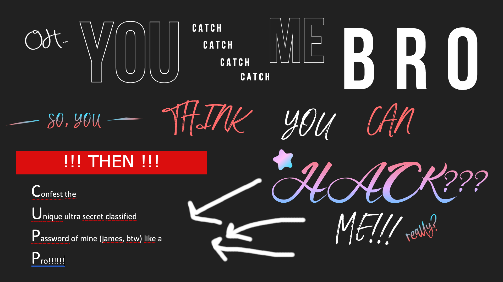
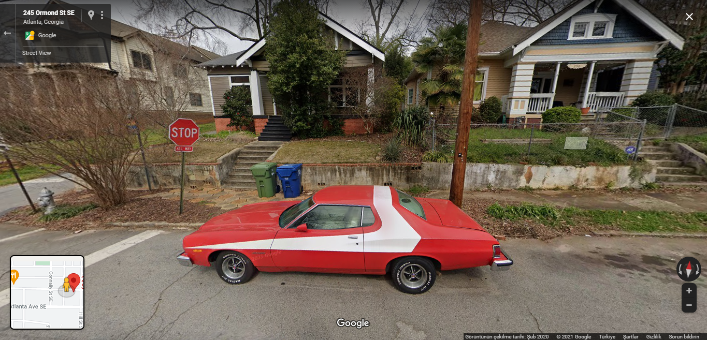
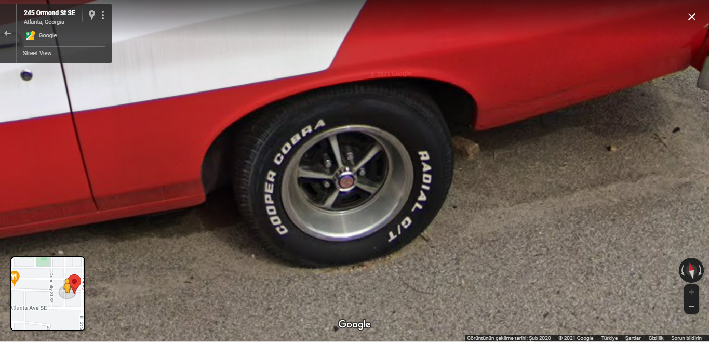
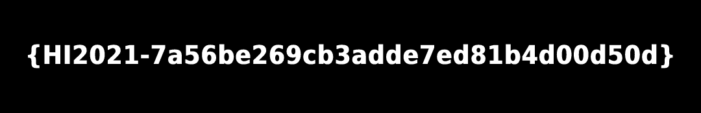

# HackIstanbul 2021 CTF - Preselection Stage WriteUp (All Challenges)

This repo has all challenges from [HackIstanbul CTF 2021](https://www.hackistanbul.com/) Preselection Stage. During the competition We solved all challenges except [XSS-BruteLogic](#xss-brutelogic) and [B2B21](#B2B21).

# CTF Concept

It was a jeopardy style CTF and 24 hours were given to complete all challenges grouped into 3 stages. Challenges were all file based and most of the challenges were relatively easy as this was preselection stage. Links were given to download files.

# Challenges

- [Stage-1](#stage-1)
	- [x] [Detailed Search](#detailed-search)
	- [x] [Guerra](#guerra)
	- [x] [Listen](#listen)
	- [x] [Listen Well](#listen-well)
	- [x] [Magic](#magic)
	- [x] [Vail](#vail)
	- [x] [Walker](#walker)
	- [x] [Where Am I](#where-am-i)
- [Stage-2](#stage-2)
	- [x] [Arcfour](#arcfour)
	- [x] [Can You Read It](#can-you-read-it)
	- [x] [Go Get](#go-get)
	- [x] [H3X](#h3x)
	- [x] [NT or LM](#nt-or-lm)
	- [x] [R0ckn R0ll](#r0ckn-r0ll)
	- [x] [What Is Password](#what-is-password)
	- [ ] [XSS-BruteLogic](#xss-brutelogic)
- [Stage-3](#stage-3)
	- [ ] [B2B21](#B2B21)
	- [x] [Find Restaurant](#find-restaurant)
	- [x] [Is It Empty](#is-it-empty)
	- [x] [Look In Detail](#look-in-detail)
	- [x] [NTML or Something Else](#ntml-or-something-else)
	- [x] [Stipes](#stipes)
	- [x] [Vulcan](#vulcan)
	- [x] [Zipped Flag](#zipped-flag)

## Stage-1

### Detailed Search

*[Detailed_Search.VT.txt](Stage-1/Detailed%20Search/Detailed_Search.VT.txt)* file was given, file had only one line of text which was looking like a SHA256 hash;

```
7f7d1069ca8a852c1c8eb36e1d988fe6a9c17ecb8eff1f66fc5ebfeb5418723a
```

*VT* text in the filename was a clear reference to [VirusTotal](https://www.virustotal.com/gui/). After searching for the hash we realized that there was a comment on Community section;

```
Hackistanbul players should come to this address for this malware.

https://pastebin.ubuntu.com/p/bw6dgzZHgG/
```

This was the content of the pastebin;

```
e0hJMjAyMS1IQUNLRVJTLU5FVkVSLUdJVkUtVVB9
```

The text seemed like Base64 encoded so a quick Base64 decode check at [CyberChef](https://gchq.github.io/CyberChef/) revealed the flag;

```
{HI2021-HACKERS-NEVER-GIVE-UP}
```

### Guerra

The organisers disabled CTF page immediately once the competition was over therefore we did not have a chance to record all of the questions, *[guerra.png](Stage-1/Guerra/guerra.png)* file and a short text were given in the question. The text was either *IAMALBERTI* or *fcncnbgsrn* **(If anyone knows/remembers what was the actual text, please contact me)**;


Google image search revealed that it is *Union Army Cipher Disk*.



One of the search results for *Union Army Cipher Disk* was a [Wikipedia Page](https://en.wikipedia.org/wiki/Cipher_disk). In that page it was mentioned that the disk is called *Alberti cipher disk*.

We used [dcode.fr](https://www.dcode.fr/alberti-cipher) to decode/encode the text, and the result was the flag (in CTF flag format);

```
{HI2021-IAMALBERTI} / {HI2021-FCNCNBGSRN}
```

### Listen

*[hist.wav](Stage-1/Listen/hist.wav)* and *[hist.zip](Stage-1/Listen/hist.zip)* (password protected) files were given as the challenge. Once the file was given to [Spectral Analysis Tool in dcode.fr](https://www.dcode.fr/spectral-analysis) a clear visible text could be seen;



```
4x5y7z11
```

Unzipping ZIP file with this password provided the file *hist.flag* and the flag was directly written inside.

```
$ unzip hist.zip
  Archive:  hist.zip
  [hist.zip] hist.flag password: 4x5y7z11
   extracting: hist.flag

$ cat hist.flag
  {HI2021-8ded3ddcf29e7434abc28b269f1ebe}
```

```
{HI2021-8ded3ddcf29e7434abc28b269f1ebe}
```

### Listen Well

*[Listen_Well.wav](Stage-1/Listen%20Well/Listen_Well.wav)* file (which was clearly morse code) was given as challenge.

Instead of decoding it manually a Google search for *morse decode online* gave results to this [tool](https://morsecode.world/international/decoder/audio-decoder-adaptive.html). Once the file was given to the tool it automatically extracted the flag;


```
{HI2021-HACKERS-ARE-EVERYWHERE}
```

### Magic

*[nothing_here.jpg](Stage-1/Magic/nothing_here.jpg)*, *[nothing_here.zip](Stage-1/Magic/nothing_here.zip)* (password protected) and *[only_the_worthy.png](Stage-1/Magic/only_the_worthy.png)* files were given as challenge. These are the things we tried without getting any result;

- nothing_here.jpg : We tried the basic checks (exiftool, steganography tools etc) but could not retrive anything.
- nothing_here.zip : We tried a few dictionaries (included rockyou) on ZIP file but could not find the correct password.

Then we started working on *only_the_worthy.png*, file command did not provide any useful information either;

```
$ file only_the_worthy.png 
  only_the_worthy.png: data
```

We checked actual bytes of the file using hexdump command;

```
$ hexdump -C -n 256 only_the_worthy.png
  00000000  00 00 00 00 00 00 00 00  00 00 00 0d 49 48 44 52  |............IHDR|
  00000010  00 00 07 80 00 00 04 38  08 06 00 00 00 e8 d3 c1  |.......8........|
  00000020  43 00 00 20 00 49 44 41  54 78 5e ec 9d 07 b8 15  |C.. .IDATx^.....|
  00000030  d5 b9 bf 97 c9 4d ae bd  63 8d 5d 8c b1 2b 06 8d  |.....M..c.]..+..|
  00000040  25 18 ec 62 6f d8 50 b9  22 d8 0b 11 4b c4 c4 82  |%..bo.P."...K...|
  00000050  88 5d 63 c5 82 8a 7a d5  18 8d 15 51 ec 8a 5d 14  |.]c...z....Q..].|
  00000060  15 0d 96 8b a2 28 f6 9e  68 d4 f8 7f de 75 ff 73  |.....(..h....u.s|
  00000070  ee a6 1c 76 9b 99 3d 7b  9f f7 7b 9e f3 1c e5 cc  |...v..={..{.....|
  00000080  5e b3 e6 5d 33 b3 d7 5a  bf af cc b4 d4 52 4b fd  |^..]3..Z.....RK.|
  00000090  18 34 09 48 40 02 12 90  80 04 24 20 01 09 48 40  |.4.H@.....$ ..H@|
  000000a0  02 12 90 80 04 24 20 01  09 48 40 02 12 90 80 04  |.....$ ..H@.....|
  000000b0  24 20 01 09 48 40 02 12  68 7a 02 33 29 00 37 fd  |$ ..H@..hz.3).7.|
  000000c0  18 7a 01 12 90 80 04 24  20 01 09 48 40 02 12 90  |.z.....$ ..H@...|
  000000d0  80 04 24 20 01 09 48 40  02 12 90 80 04 24 20 01  |..$ ..H@.....$ .|
  000000e0  09 48 40 02 12 90 80 04  22 01 05 60 6f 04 09 48  |.H@....."..`o..H|
  000000f0  40 02 12 90 80 04 24 20  01 09 48 40 02 12 90 80  |@.....$ ..H@....|
```

*IHDR* and *IDAT* chunk names (and file extension) were suggesting that this was actually a PNG file, however first 8 bytes were suppose to be *89 50 4E 47 0D 0A 1A 0A* in a PNG file. After correcting those bytes we were able to open the image;



On the bottom left side of the image, letters *C U P P* seemed like a reference to something. We did a quick seach on Google and found this [tool](https://github.com/Mebus/cupp). This was a tool to create custom dictionary based on personal information. We ran the script to create the dictionary;

```
$ sudo ./cupp.py -i
   ___________ 
     cupp.py!                 # Common
        \                     # User
         \   ,__,             # Passwords
          \  (oo)____         # Profiler
             (__)    )\   
                ||--|| *      [ Muris Kurgas | j0rgan@remote-exploit.org ]
                              [ Mebus | https://github.com/Mebus/]
  
  [+] Insert the information about the victim to make a dictionary
  [+] If you don't know all the info, just hit enter when asked! ;)
  
  
  > First Name: james
  > Surname: 
  > Nickname: 
  > Birthdate (DDMMYYYY): 
  
  
  > Partners) name: 
  > Partners) nickname: 
  > Partners) birthdate (DDMMYYYY): 
  
  
  > Child's name: 
  > Child's nickname: 
  > Child's birthdate (DDMMYYYY): 
  
  
  > Pet's name: 
  > Company name: 
  
  
  > Do you want to add some key words about the victim? Y/[N]: 
  > Do you want to add special chars at the end of words? Y/[N]: 
  > Do you want to add some random numbers at the end of words? Y/[N]:
  > Leet mode? (i.e. leet = 1337) Y/[N]: y
  
  [+] Now making a dictionary...
  [+] Sorting list and removing duplicates...
  [+] Saving dictionary to james.txt, counting 504 words.
  > Hyperspeed Print? (Y/n) : n
  [+] Now load your pistolero with james.txt and shoot! Good luck!
  ```

After getting custom dictionary we tried to crack ZIP file using john;

```
$ zip2john nothing_here.zip > hash.txt

$ john --wordlist=james.txt hash.txt 
  Using default input encoding: UTF-8
  Loaded 1 password hash (PKZIP [32/64])
  Will run 4 OpenMP threads
  Press 'q' or Ctrl-C to abort, almost any other key for status
  semaJ1990        (nothing_here.zip/the_rabbit_hole)
  1g 0:00:00:00 DONE (2021-08-08 15:50) 100.0g/s 50400p/s 50400c/s 50400C/s 53m4J1990..semaj_2020
  Use the "--show" option to display all of the cracked passwords reliably
  Session completed
```

The password was *semaJ1990*, we unzipped the archive and investigated the file inside;

```
$ unzip nothing_here.zip
  Archive:  nothing_here.zip
  [nothing_here.zip] the_rabbit_hole password: semaJ1990
   extracting: the_rabbit_hole

$ file the_rabbit_hole
  the_rabbit_hole: ASCII text

$ cat the_rabbit_hole 
  {HI2021-5bd24d0719725d5ac32db4840e4d1e}
```

```
  {HI2021-5bd24d0719725d5ac32db4840e4d1e}
```

### Vail

*[Vail.txt](Stage-1/Vail/Vail.txt)* file was given and it was abvious that this was another morse code challenge. 

```
.... .. ..--- ----- ..--- .---- -....- -.-. .- ..- --. .... - -- . 

/ -..-. 

/ -.. --- -. .----. - 

/ ..-. --- .-. --. . - 

/ - --- 

/ .- -.. -.. 

/ - .... . 

/ .--. .- .-. . -. - .... . ... . ...
```

Morse decode at [CyberChef](https://gchq.github.io/CyberChef/) gave the flag;

```
HI2021-CAUGHTME  /  DON'T  FORGET  TO  ADD  THE  PARENTHESES
```
```
{HI2021-CAUGHTME}
```

### Walker

*[classified](Stage-1/Walker/classified)*, *[daniel_wright.pdf](Stage-1/Walker/daniel_wright.pdf)*, *[doc](Stage-1/Walker/doc)*, *[loc](Stage-1/Walker/loc)* and *[private](Stage-1/Walker/private)* files were given as challenge. The contents of *classified* file was looking like Base32 as all letters were capital, an attempt for Base32 decoding at [CyberChef](https://gchq.github.io/CyberChef/) revealed the text below;

```
Hello Walker,

You know we've been after this guy for a long time.In my conversations with local sources, they said that they are close and that they will take him over soon. We have the document, but if they catch him, we'll never be able to open it. The data in it is very important to us, we cannot allow this. They know that the man is in Atlanta now, but they still have no idea of his exact location. We must be quick. We've been working on this guy all night. It cost me a lot, but I got some information from my sources. One is that the man is a narcissist and presents himself as C.Cobra. We know he is obsessed with this name because it's everywhere. In the games he plays, in his cyberspace nicknames, even at the end of his manifestos. Another thing that caught our attention is that he did not change his car. Everywhere he goes he has different license plates but exactly the same car. If you can find it, definitely check it out. There must be a reason for this. The other thing is, we  partially know where the man is right now. There is a deviation of only a few hundred meters in diameter. We knew he would use a Proxy, as we know he doesn't trust VPN services while doing his illegal business. We forced all the infrastructure in the neighborhood to use one of our servers, we tracked the IP Addresses in the records. This morning, a transfer took place from the IP Address we thought was his, and a private backed up to another server right after. Luckily we were able to take over the private. It has the same fingerprint as the public that encrypts the document, that's definitely our key. But we have a problem. He implemented a password protection to the key, a passphrase. We are trying to crack it, but still no result. We think it may be related to the name C.Cobra. Maybe it's an expansion of both or one of this words. That's all the information we have. I'll also send you his estimated location, he must be staying somewhere right now, it's a quiet street also. If you want, take a look from the satellite or go near him. I am sending the document and private as well. We need that passphrase to read the document. Our time is running out. Good luck.
```

When we analyzed the text carefully these were the key information it provides to us;
- The person we were looking for was in Atlanta
- His location was suppose to derivate only a few hundred meters and satallite could be used to check his location
- He was using the same car but different license plates
- His private key was captured but it was protected by a passphrase
- Passphrase for private key should be related with expansion of word/words *C.Cobra*

We needed more information to continue the investigation, by reading *daniel_wright.pdf* file we got this extra information;
- He was using a Red American Muscle Car with white decal

Inside *loc* file his exact location was given;
- 265 Ormond St SE, Atlanta, Georgia

We had enough information to check Google Maps for his location. Once we shifted to street view and moved a few hundred meters, we found this car;



Zoomed in on tyres;



The expanded version of *C.Cobra* was *Cooper Cobra*.

We tried the combination of these two as passphrase and it directly gave us the private key. There was no need for brute forcing using custom dictionary with words *cooper* and *cobra* (with other possible words included).

```
$ openssl rsa -in private -out mykey.key
  passphrase: coopercobra
```

A decryption on file *doc* using extracted private key revealed the flag;

```
$ openssl rsautl -decrypt -inkey mykey.key < doc > decrypted
```

These were the contents of decrypted file;

```
Hi James,
Thanks for transfer in $. Now, let me send the password for account.

{HI2021-a6f7b874ea69329372ad75353314d7}

It was a pleasure working with you.
Daniel W.
```

```
{HI2021-a6f7b874ea69329372ad75353314d7}
```

### Where Am I

*[whereami.jpg](Stage-1/Where%20Am%20I/whereami.jpg)* file was given;


After a Google image search this newspaper article was found;


And the flag was;
```
{HI2021-SANLIURFA-GAP-HAVALIMANI}
```

## Stage-2

### Arcfour

*[Arcfour.png](Stage-2/Where%20Am%20I/Arcfour.png)* file was given;


First we had to correct distorted image. The effect used to distort QR code was swirl, [an online photo editor](https://www3.lunapic.com/editor/) used to undo the swirl effect. This was the result;


By decoding QR code using this [online tool](https://www.freecodeformat.com/qrdecode.php), we got following text;

```
UGpiMlBGR3dPSDZRU2VqNkhaaGVocVRWMUFYcmU5RnJYcWFhdHRzbldaUTZoMCthS0MvcXpxcz0KUGFzczpDQkNIYWNrSXN0YW5idWw=
```

This was another Base64 encoded message, [CyberChef](https://gchq.github.io/CyberChef/) was used to decode it;

```
Pjb2PFGwOH6QSej6HZhehqTV1AXre9FrXqaattsnWZQ6h0+aKC/qzqs=
Pass:CBCHackIstanbul
```

We got another ciphertext and a passphrase but this time we did not know the cipher used. After a while we decided to search for the word *arcfour* on Google and found this [wikipedia page](https://en.wikipedia.org/wiki/RC4). Arcfour was  synonym for RC4. Once the cipher was identified [CyberChef](https://gchq.github.io/CyberChef/) was used again to decode the text;

```
{HI2021-62f170fb07fdbb79ceb7147101406eb8}
```

### Can You Read It

*[CanYouReadIt.png](Stage-2/Can%20You%20Read%20It/CanYouReadIt.png)* file was given;


There were barcodes on the given picture, we found [this site](https://online-barcode-reader.com/) with a Google search. Using this tool two parts of barcodes were decoded;


```
**000026  2014011325B
```


```
**I2021-01504f3b8b252f5619c94fd65dc52}
```

First two characters were not properly recognised for both pictures however second text was matching CTF flag format *{HI2021-XXXXXXXXX}* and it was actually the flag.

```
{HI2021-01504f3b8b252f5619c94fd65dc52}
```

### Go Get

*[go_GET](Stage-2/Go%20Get/go_GET)* file was given, in order to identify the file type we used *file* command;

```
$ file go_GET
  go_GET: ELF 64-bit LSB executable, x86-64, version 1 (SYSV), statically linked, Go BuildID=51tgX5tRN32ji8wAkZlq/hzqC57d8vyrPXtOqmZp_/m5bE9bvOQdwiWc_VgDaB/xQNqr2WgU5YTLPKj6kNE, stripped
```

So this was a 64 bit ELF executable file written in Go, we gave it permission to run and executed it to see the reaction from the program;

```
$ chmod +x go_GET

$ ./go_GET                              
  2021/08/07 17:52:32 Got it
```

The *go* part in filename was a reference to Go language and *GET* was probably a reference to HTTP GET request. Program was probably making a HTTP GET request to a server. In order to test this hypothesis we captured network traffic using Wireshark while program was running and the program was indeed making a HTTP GET request to *[https://www.hackistanbul.com/e0hJMjAyMS01NGRhNzRjYzg4MWRjMTQyMmQwNWFhMDIxZWE0MTJlOH0=](https://www.hackistanbul.com/e0hJMjAyMS01NGRhNzRjYzg4MWRjMTQyMmQwNWFhMDIxZWE0MTJlOH0=)*.


Server was responding with [HTTP status code](https://en.wikipedia.org/wiki/List_of_HTTP_status_codes) 301, redirecting the connection to the same URL and was not sending any actual data. We got stuck here for a while but then decived to try to Base64 decode the last part of the URL which gave the flag;

```
$ echo e0hJMjAyMS01NGRhNzRjYzg4MWRjMTQyMmQwNWFhMDIxZWE0MTJlOH0= | base64 -d    
  {HI2021-54da74cc881dc1422d05aa021ea412e8} 
```

```
{HI2021-54da74cc881dc1422d05aa021ea412e8}
```

### H3X

*[H3X.txt](Stage-2/H3X/H3X.txt)* file was given which was having a long text of hex value. *xxd* command was used to convert it to a file and then file type was checked which revealed that this was a PNG file;

```
$ cat H3X.txt | xxd -r -p > out

$ file out        
  out: PNG image data, 1080 x 1080, 8-bit/color RGBA, non-interlaced

$ mv out out.png
```



```
{HI2021-7a56be269cb3adde7ed81b4d00d50d}
```

### NT or LM

*[NT_0R_LM.ram](Stage-2/NT%20or%20LM/NT_0R_LM.ram)* file was given and challenge was asking for a certain user's hash value. From filesize and extension it looked like a memory dump so [volatility](https://github.com/volatilityfoundation/volatility) tool was used to investigate the image;

```
$ ./vol.py imageinfo -f NT_0R_LM.ram
  Volatility Foundation Volatility Framework 2.6.1
  INFO    : volatility.debug    : Determining profile based on KDBG search...
            Suggested Profile(s) : Win7SP1x64, Win7SP0x64, Win2008R2SP0x64, Win2008R2SP1x64_24000, Win2008R2SP1x64_23418, Win2008R2SP1x64, Win7SP1x64_24000, Win7SP1x64_23418
                       AS Layer1 : WindowsAMD64PagedMemory (Kernel AS)
                       AS Layer2 : FileAddressSpace (/home/kali/Desktop/NT_0R_LM.ram)
                        PAE type : No PAE
                             DTB : 0x187000L
                            KDBG : 0xf800029f30a0L
            Number of Processors : 1
       Image Type (Service Pack) : 1
                  KPCR for CPU 0 : 0xfffff800029f4d00L
               KUSER_SHARED_DATA : 0xfffff78000000000L
             Image date and time : 2021-06-20 19:28:04 UTC+0000
       Image local date and time : 2021-06-20 22:28:04 +0300
```

```
$ sudo ./vol.py hivelist --profile=Win7SP1x64 -f NT_0R_LM.ram
  Volatility Foundation Volatility Framework 2.6.1
  Virtual            Physical           Name
  ------------------ ------------------ ----
  0xfffff8a00000d230 0x0000000026d85230 [no name]
  0xfffff8a000024010 0x00000000270f0010 \REGISTRY\MACHINE\SYSTEM
  0xfffff8a000061010 0x000000002712f010 \REGISTRY\MACHINE\HARDWARE
  0xfffff8a00010f010 0x00000000213fc010 \Device\HarddiskVolume1\Boot\BCD
  0xfffff8a0012d4010 0x00000000205ae010 \SystemRoot\System32\Config\SOFTWARE
  0xfffff8a0012de010 0x000000001e5aa010 \??\C:\Windows\ServiceProfiles\NetworkService\NTUSER.DAT
  0xfffff8a00155a410 0x000000001efd8410 \SystemRoot\System32\Config\SECURITY
  0xfffff8a0015d4010 0x000000001f1c2010 \SystemRoot\System32\Config\SAM
  0xfffff8a001647010 0x000000001e877010 \??\C:\Windows\ServiceProfiles\LocalService\NTUSER.DAT
  0xfffff8a001a03410 0x000000000dfce410 \??\C:\Users\effective\ntuser.dat
  0xfffff8a001a5d410 0x000000000d75c410 \??\C:\Users\effective\AppData\Local\Microsoft\Windows\UsrClass.dat
  0xfffff8a005db4010 0x00000000201c3010 \SystemRoot\System32\Config\DEFAULT
```

```
$ sudo ./vol.py hashdump --profile=Win7SP1x64 -f NT_0R_LM.ram -y 0xfffff8a000024010 -s 0xfffff8a0015d4010 
  Volatility Foundation Volatility Framework 2.6.1
  Administrator:500:aad3b435b51404eeaad3b435b51404ee:31d6cfe0d16ae931b73c59d7e0c089c0:::
  Guest:501:aad3b435b51404eeaad3b435b51404ee:31d6cfe0d16ae931b73c59d7e0c089c0:::
  effective:1000:aad3b435b51404eeaad3b435b51404ee:e45a314c664d40a227f9540121d1a29d:::
  HomeGroupUser$:1002:aad3b435b51404eeaad3b435b51404ee:0609c7cb7ab9ba547c23fd7fe1aa12b8:::
  hackistanbul:1003:aad3b435b51404eeaad3b435b51404ee:049c5449f08de05c3f06d2a22dd0b593:::
```

The flag was the hash value for hackistanbul user;

```
{HI2021-049c5449f08de05c3f06d2a22dd0b593}
```

### R0ckn R0ll

*[R0cknR0ll.pcap](Stage-2/R0ckn%20R0ll/R0cknR0ll.pcap)* file was given. After an investigation on Wireshark we saw that Gobuster was used to scan folders and some files were found. We have used the filter *http.response.code == 200* in order to check the contents of files found. There were 3 interesting files;


```

1/3 

PNEESMRQGIYS2U3XGMZXIXY=


```


```

2/3 

Q2gxbERfT18=

```


```
3/3

5b79c0b5029b7e1bf25767d93bb07321


ENJ0Y! https://www.youtube.com/watch?v=1w7OgIMMRc4 

```

This was what we initially though they were;

- 1/3
	- PNEESMRQGIYS2U3XGMZXIXY= : Base32
- 2/3
	- Q2gxbERfT18= : Base64
- 3/3
	- 5b79c0b5029b7e1bf25767d93bb07321 : MD5 Hash
	- ENJ0Y! https://www.youtube.com/watch?v=1w7OgIMMRc4 : A hint for cracking hash

For the first two were were right;

```
$ echo PNEESMRQGIYS2U3XGMZXIXY= | base32 -d                                
  {HI2021-Sw33t_

$ echo Q2gxbERfT18= | base64 -d                                       
  Ch1lD_O_
```
The last one was a little tricky, we searched online databases like [CrackStation](https://crackstation.net/) and [md5decrypt](https://md5decrypt.net/en/) for known MD5 hash values but there was no matching result. They gave a reference to [Guns N' Roses - Sweet Child O' Mine (Official Music Video)](https://www.youtube.com/watch?v=1w7OgIMMRc4) which was matching with first two parts of the flag. We guessed that last part would include some form of word *mine*, probably *M1n3* ([leetspeak](https://en.wikipedia.org/wiki/Leet)). Thats why we tried to bruteforce the hash value;

```
$ hashcat -a 3 -m 0 -1 ?l?u?d?s hash.txt ?1?1?1?1\}
```

We have tried other lengths and combinations but were not able to crack it.


```
$ hashcat -a 3 -m 0 -1 ?l?u?d?s hash.txt M1n3?1?1?1?1?1?1\}
```

We got stuck here for some time and focused on other challenges. Once we returned back to this challenge we decided to play around with the given value on [CyberChef](https://gchq.github.io/CyberChef/) and by pure luck we found out that it was not an MD5 hash, it was a RC2 ciphertext;


```
M1n3_R0CK}
```

```
{HI2021-Sw33t_Ch1lD_O_M1n3_R0CK}
```

### What Is Password

*[WhatIsPassword.pcap](Stage-2/What%20Is%20Password/WhatIsPassword.pcap)* file was given. After an investigation on Wireshark we extracted a few files from HTTP responses;

- [index.html](Stage-2/What%20Is%20Password/Solution/WebPage/index.html) : A web page visited
- [style.css](Stage-2/What%20Is%20Password/Solution/WebPage/style.css) : Style sheet of web page visited
- [HI.rar](Stage-2/What%20Is%20Password/Solution/HI.rar) : A password protected RAR file
- [Keyboard-Combinations.txt](Stage-2/What%20Is%20Password/Solution/Keyboard-Combinations.txt) : A long list of texts which looks like a dictionary

We started by opening the web page and tried to find any hint about the flag. We also had a password protected RAR file and a list which seems like a dictionary, so we started [john](https://www.openwall.com/john/) to try to crack the password with given dictionary.

```
$ rar2john HI.rar > hash.txt

$ john --wordlist=Keyboard-Combinations.txt hash.txt
  Using default input encoding: UTF-8
  Loaded 1 password hash (RAR5 [PBKDF2-SHA256 128/128 AVX 4x])
  Cost 1 (iteration count) is 32768 for all loaded hashes
  Will run 4 OpenMP threads
  Press 'q' or Ctrl-C to abort, almost any other key for status
  xsw2@#$%         (HI.rar)
  1g 0:00:00:00 DONE (2021-08-08 10:17) 1.298g/s 249.3p/s 249.3c/s 249.3C/s xsw27890..xsw2$R#E
  Use the "--show" option to display all of the cracked passwords reliably
  Session completed
```

John managed to crack the password which was *xsw2@#$%*, so we started focusing on the RAR file.

```
$ unrar e -pxsw2@#$% HI.rar
```

This image was extracted from archive;


In CTFs it is a good practice to always check Metadata of an image file;

```
$ exiftool HI.jpg
  ...
  Text Layer Name                 : {HI2021-fcc637036c3c11f699c22c243dd82a}
  Text Layer Text                 : {HI2021-xxxxxxxxxxxxxxxxxxxxxxxx}
  ...
```

```
{HI2021-fcc637036c3c11f699c22c243dd82a}
```

### XSS-BruteLogic

**Note :** We were not able to solve this challenge during competition.

*[XSS-BruteLogic.zip](Stage-2/XSS-BruteLogic/XSS-BruteLogic.zip)* file was given. First thing we did was to unzip the archive;

```
$ unzip XSS-BruteLogic.zip                                                                                                            1 ⨯
  Archive:  XSS-BruteLogic.zip
    creating: .git/
    creating: .git/branches/
    inflating: .git/config             
    inflating: .git/description        
    inflating: .git/HEAD               
    creating: .git/hooks/
    inflating: .git/hooks/applypatch-msg.sample  
    inflating: .git/hooks/commit-msg.sample  
    inflating: .git/hooks/fsmonitor-watchman.sample  
    inflating: .git/hooks/post-update.sample  
    inflating: .git/hooks/pre-applypatch.sample  
    inflating: .git/hooks/pre-commit.sample  
    inflating: .git/hooks/pre-push.sample  
    inflating: .git/hooks/pre-rebase.sample  
    inflating: .git/hooks/pre-receive.sample  
    inflating: .git/hooks/prepare-commit-msg.sample  
    inflating: .git/hooks/update.sample  
    inflating: .git/index              
    creating: .git/info/
    inflating: .git/info/exclude       
    creating: .git/logs/
    inflating: .git/logs/HEAD          
    creating: .git/logs/refs/
    creating: .git/logs/refs/heads/
    inflating: .git/logs/refs/heads/master  
    creating: .git/logs/refs/remotes/
    creating: .git/logs/refs/remotes/origin/
    inflating: .git/logs/refs/remotes/origin/HEAD  
    creating: .git/objects/
    creating: .git/objects/2b/
    inflating: .git/objects/2b/42a92ca4caf19c11ab074f72c7e5105f2654ec  
    creating: .git/objects/68/
    inflating: .git/objects/68/693561bd3d7f6bd73ed511a7e1d64a3b4b955e  
    creating: .git/objects/85/
    inflating: .git/objects/85/70ba168b0422e6dab154f7903f8935f42100c4  
    creating: .git/objects/ae/
    inflating: .git/objects/ae/dc1dd273eb9050a106c2fa4dc64c76b529c88c  
    creating: .git/objects/b1/
    inflating: .git/objects/b1/bbb90ece74c4069d8d4ec68dfb3d36b50cedfc  
    creating: .git/objects/b2/
    inflating: .git/objects/b2/118f2b43dea4f1c7611c00c22d07b2ee4234e3  
    creating: .git/objects/b7/
    inflating: .git/objects/b7/c34027b393d6f66be35f936e0d551cb98909c1  
    creating: .git/objects/bc/
    inflating: .git/objects/bc/3f1fdccb393d7cb8dfb1af6f5afb0729bde4a8  
    creating: .git/objects/cd/
    inflating: .git/objects/cd/239607b65987db6a3d8f0bfbf29d621a83e6c4  
    creating: .git/objects/info/
    creating: .git/objects/pack/
    inflating: .git/packed-refs        
    creating: .git/refs/
    creating: .git/refs/heads/
    inflating: .git/refs/heads/master  
    creating: .git/refs/remotes/
    creating: .git/refs/remotes/origin/
    inflating: .git/refs/remotes/origin/HEAD  
    creating: .git/refs/tags/
    inflating: XSS-BruteLogic.txt.png  
```

It extracted *XSS-BruteLogic.txt.png* file and *.git* folder. Git data was investigated;

```
$ git remote -v
  origin  https://github.com/Effective1212/Steganography.git (fetch)
  origin  https://github.com/Effective1212/Steganography.git (push)

$ git log
  commit 2b42a92ca4caf19c11ab074f72c7e5105f2654ec (HEAD -> master, origin/master, origin/HEAD)
  Author: Effective1212 <60982688+Effective1212@users.noreply.github.com>
  Date:   Wed Mar 25 21:15:22 2020 +0300

      Update README.md

  commit b2118f2b43dea4f1c7611c00c22d07b2ee4234e3
  Author: Effective1212 <60982688+Effective1212@users.noreply.github.com>
  Date:   Wed Mar 25 21:14:58 2020 +0300

      Create steg.py

  commit 68693561bd3d7f6bd73ed511a7e1d64a3b4b955e
  Author: Effective1212 <60982688+Effective1212@users.noreply.github.com>
  Date:   Wed Mar 25 21:14:33 2020 +0300

      Initial commit
```

Github [repo](https://github.com/Effective1212/Steganography.git) was found, we went through commit history to find any deleted secret but there were only 3 commits which only added new files to repo. Repo was cloned for further investigation;

```
$ git clone https://github.com/Effective1212/Steganography.git
```

We analyzed the python script and figured that we needed to find the correct password however our brute force attempts failed and we did not have any clue to proceed further. We got stuck at this point during competition.

**Note :** The steps after this point (for this challenge) are taken from another [HACKISTANBUL’21 WRITE UP](https://pwnlab.me/tr-hackistanbul-21-write-up/) which we found while writing this one.

> A Google search for challenge name *XSS-BruteLogic* reveals [this](https://github.com/swisskyrepo/PayloadsAllTheThings/blob/master/XSS%20Injection/Intruders/BRUTELOGIC-XSS-STRINGS.txt) list/dictionary.
> 
> A decode function is needed to decode the data therefore [this](https://github.com/Aporlorxl23/CTF/blob/main/HI2021/XSS-BruteLogic/XSS-BruteLogic.py) python script is written. By brute forcing the key is found to be *-alert(1)-* which decodes following value;
> 
> ```
> aebba87c9aa9548f65132553304ade32
> ```
> 
> Referenced writeup was not clear about the final flag, we assume it is;
> 
> ```
> ??? {HI2021-aebba87c9aa9548f65132553304ade32} ???
> ```

## Stage-3

### B2B21

**Note :** We were not able to solve this challenge during competition we ran out of time while working on it.

*[b2b21.tar](Stage-3/B2B21c/b2b21.tar)* file was given. First thing we did was to untar the archive;

```
$ tar -xf b2b21.tar 
```

Extracted file was another TAR archive, which has another TAR archive inside (which has another TAR archive inside and so on). It was obvious that the process needed to be automated in order to get to last file inside the last TAR archive. We have written a python script [step1_untar.py](Stage-3/B2B21c/Solution/step1_untar.py) in order to do this;

```
$ python step1_untar.py
  Extracting : ~/CTF/HackIstanbul2021/stage3/b2b21/b2b21.tar
  Extracting : ~/CTF/HackIstanbul2021/stage3/b2b21/2.tar
  Extracting : ~/CTF/HackIstanbul2021/stage3/b2b21/3.tar
  ...
  Extracting : ~/CTF/HackIstanbul2021/stage3/b2b21/1230.tar
  Extracting : ~/CTF/HackIstanbul2021/stage3/b2b21/1231.tar
  Extracting : ~/CTF/HackIstanbul2021/stage3/b2b21/1232.tar
```

This gave us a folder named *CTF_flg* which had other folders (A to N) and a file named *ascii.pdf.gpg*. Inside these subfolders there were ZIP archives (similar setup with TAR arhives, archive inside archive) waiting to be unzipped. Another python script [step2_unzip.py](Stage-3/B2B21c/Solution/step2_unzip.py) was written in order to achive this;

```
$ python step2_unzip.py 
   File : ~/CTF/HackIstanbul2021/stage3/b2b21/CTF_flg/B/flag.txt
   File : ~/CTF/HackIstanbul2021/stage3/b2b21/CTF_flg/M/flag.txt
   File : ~/CTF/HackIstanbul2021/stage3/b2b21/CTF_flg/D/flag.txt
   File : ~/CTF/HackIstanbul2021/stage3/b2b21/CTF_flg/A/flag.txt
   File : ~/CTF/HackIstanbul2021/stage3/b2b21/CTF_flg/N/flag.txt
   File : ~/CTF/HackIstanbul2021/stage3/b2b21/CTF_flg/G/flag.txt
   File : ~/CTF/HackIstanbul2021/stage3/b2b21/CTF_flg/E/flag.txt
  Error : ~/CTF/HackIstanbul2021/stage3/b2b21/CTF_flg/F/221.zip
   File : ~/CTF/HackIstanbul2021/stage3/b2b21/CTF_flg/H/flag.txt
   File : ~/CTF/HackIstanbul2021/stage3/b2b21/CTF_flg/I/flag.txt
   File : ~/CTF/HackIstanbul2021/stage3/b2b21/CTF_flg/L/flag.txt
   File : ~/CTF/HackIstanbul2021/stage3/b2b21/CTF_flg/J/flag.txt
   File : ~/CTF/HackIstanbul2021/stage3/b2b21/CTF_flg/K/flag.txt
   File : ~/CTF/HackIstanbul2021/stage3/b2b21/CTF_flg/C/flag.txt
```

The file *CTF_flg/F/221.zip* was having password protection and the flag was inside this archive. We tried to crack it using john (wordlists/brute force) but our attempts were unsuccessful.

After this we focused on *CTF_flg/ascii.pdf.gpg* file, we tried to crack it using john;

```
$ gpg2john ascii.pdf.gpg > hash.txt

  File ascii.pdf.gpg
  [gpg2john] MDC is missing, expect lots of false positives!

$ john --wordlist=/usr/share/wordlists/rockyou.txt hash.txt
  Using default input encoding: UTF-8
  Loaded 1 password hash (gpg, OpenPGP / GnuPG Secret Key [32/64])
  Cost 1 (s2k-count) is 14155776 for all loaded hashes
  Cost 2 (hash algorithm [1:MD5 2:SHA1 3:RIPEMD160 8:SHA256 9:SHA384 10:SHA512 11:SHA224]) is 2 for all loaded hashes
  Cost 3 (cipher algorithm [1:IDEA 2:3DES 3:CAST5 4:Blowfish 7:AES128 8:AES192 9:AES256 10:Twofish 11:Camellia128 12:Camellia192 13:Camellia256]) is 3 for all loaded hashes
  Will run 4 OpenMP threads
  Note: This format may emit false positives, so it will keep trying even after
  finding a possible candidate.
  Press 'q' or Ctrl-C to abort, almost any other key for status
  princess         (?)
  1g 0:00:00:36 0.01% (ETA: 2021-08-02 15:51) 0.02777g/s 74.09p/s 74.09c/s 74.09C/s jester..married
  1g 0:00:00:38 0.02% (ETA: 2021-08-02 15:56) 0.02630g/s 73.98p/s 73.98c/s 73.98C/s renee1..medicina
  1g 0:00:00:40 0.02% (ETA: 2021-08-02 15:52) 0.02498g/s 73.96p/s 73.96c/s 73.96C/s sexy..lebron
  1g 0:00:00:41 0.02% (ETA: 2021-08-02 15:53) 0.02439g/s 73.95p/s 73.95c/s 73.95C/s abc1234..gordito
  1g 0:00:00:42 0.02% (ETA: 2021-08-02 15:54) 0.02379g/s 73.85p/s 73.85c/s 73.85C/s marita..youandme
  1g 0:00:00:43 0.02% (ETA: 2021-08-02 15:52) 0.02324g/s 73.82p/s 73.82c/s 73.82C/s dollar..66666
  ...
```

John has found password *princess* but not sure if it was the correct passphrase. During the last minutes of actual competition this was the question we were working on (one of the two questions we were not able to solve) and the CTF was over while john was still running. We were in a hurry to solve the challenge before competition ends therefore we just missed out the fact that we could decrpt GPG file with password *princess*. We were trying other methods which were not successful.

**Note :** The steps after this point (for this challenge) are taken from another [HACKISTANBUL’21 WRITE UP](https://pwnlab.me/tr-hackistanbul-21-write-up/) which we found while writing this one.

> *ascii.pdf.gpg* file can be decrypted with password *princess*
>
> ```
> $ gpg --ignore-mdc-error --decrypt ascii.pdf.gpg
>   gpg: CAST5.CFB encrypted data
>   gpg: encrypted with 1 passphrase
>   79 104 33 32 78 111 44 32 89 111 117 32 109 117 115 116 32 99 111 110 116 105 110 117 101 46 32 84 104 105 115 32 116 101 120 116 32 104 97 115 110 39 116 32 103 111 116 32 97 32 123 70 125 108 97 103 32 58 68 32 123 67 84 70 45 67 48 110 116 49 78 117 51 125 10
>   gpg: WARNING: message was not integrity protected
> ```
>
> Values can be converted to ASCII at [CyberChef](https://gchq.github.io/CyberChef/), which gives the text;
> 
> ```
> Oh! No, You must continue. This text hasn't got a {F}lag :D {CTF-C0nt1Nu3}
> ```
> 
> The password of the archive *CTF_flg/F/221.zip* is *CTF-C0nt1Nu3*.
>
> ```
> $ unzip 221.zip
>   Archive:  221.zip
>   [221.zip] flag.exe password: CTF-C0nt1Nu3
>   inflating: flag.exe
> 
> $ cat flag.exe                 
>   01111011 01001000 01001001 00110010 00110000 00110010 00110001 00101101 01000111 00110000 00110000 01100100 01001010 00110000 01100010 01000110 00110001 01101110 01000100 01101101 00110011 01010111 00110011 00110100 01110100 00110100 00110010 00111000 01001000 01110110 00110110 01011001 01010011 01011010 00110001 01010000 01110011 00110011 01111101
> ```
> 
> Values can be converted to ASCII at [CyberChef](https://gchq.github.io/CyberChef/), which gives the flag;
> 
> ```
> {HI2021-G00dJ0bF1nDm3W34t428Hv6YSZ1Ps3}
> ```

### Find Restaurant

*[Find_Restaurant.jpg](Stage-3/Find%20Restaurant/Find_Restaurant.jpg)* file was given;


We made a Google image search for the restaurant;


One of the search results was on [Foursquare](https://tr.foursquare.com/v/define-b%C3%BCfe/4c272bee905a0f47877c6460) and the flag was written as a comment for the restaurant;


```
{HI2021-1MA2K42RZ3V91A10483NS1ZG01G35Z}
```

### Is It Empty

*[is_it_empty.jpeg](Stage-3/Is%20It%20Empty/is_it_empty.jpeg)* file was given;


We tried a few steganography tools and [stegoveritas](https://github.com/bannsec/stegoVeritas) revealed a hidden text on the bottom left;

```
$ stegoveritas is_it_empty.jpeg 
```


```
atbash.pdf
```

We also tried [stegseek](https://github.com/RickdeJager/StegSeek) and it retrived *b1.tar.gz* file from the image;

```
$ stegseek is_it_empty.jpeg /usr/share/wordlists/rockyou.txt 
  StegSeek 0.6 - https://github.com/RickdeJager/StegSeek

  [i] Found passphrase: "california"     

  [i] Original filename: "b1.tar.gz".
  [i] Extracting to "is_it_empty.jpeg.out".

$ mv is_it_empty.jpeg.out b1.tar.gz
```

We tried to extract *b1.tar.gz* file which gave an error, but file command was claiming that it was a GZIP archive;

```
$ gzip -d b1.tar.gz 
  gzip: b1.tar.gz: unknown method 68 -- not supported

$ file b1.tar.gz
  b1.tar.gz: gzip compressed data, unknown method, has CRC, extra field, last modified: Fri Apr 10 14:48:13 1998, original size modulo 2^32 172379973
```

We tried searching the error on Google but could not find any useful information. Then we starting investiging the bytes of the header;

```
$ xxd -g 1 b1.tar.gz | head
  00000000: 1f 8b 44 46 2d 31 2e 35 0a 25 c3 a4 c3 bc c3 b6  ..DF-1.5.%......
  00000010: c3 9f 0a 32 20 30 20 6f 62 6a 0a 3c 3c 2f 4c 65  ...2 0 obj.<</Le
  00000020: 6e 67 74 68 20 33 20 30 20 52 2f 46 69 6c 74 65  ngth 3 0 R/Filte
  00000030: 72 2f 46 6c 61 74 65 44 65 63 6f 64 65 3e 3e 0a  r/FlateDecode>>.
  00000040: 73 74 72 65 61 6d 0a cd af ea 35 30 e8 6b cc 0a  stream....50.k..
  00000050: ff 27 6a a5 03 ed d6 ce fd 8a f0 01 4e 45 91 08  .'j.........NE..
  00000060: 17 1f 67 11 fa 82 63 7e dc c0 c6 cd bd e1 78 26  ..g...c~......x&
  00000070: 05 25 cb cc 20 ca 2d 4f e7 76 35 c6 41 7a c0 2e  .%.. .-O.v5.Az..
  00000080: 30 44 a9 9e c8 b0 cb f0 27 45 11 98 27 eb 0c b1  0D......'E..'...
  00000090: c2 96 50 66 21 2e 39 ad bc 55 63 ae b1 0d 67 48  ..Pf!.9..Uc...gH
```

First bytes of the file (*1F 8B*) matches GZIP archive file signature according to [Wikipedia](https://en.wikipedia.org/wiki/List_of_file_signatures) thats why file command claims that this is a GZIP archive. According this [this site](https://www.garykessler.net/library/file_sigs.html) GZIP archive should start with *1F 8B **08***, which kind of explains about error *unknown method 68 -- not supported*. Third byte of the file is 0x44 (which is 68 in decimal) instead of 0x08.

[GZIP file format specification version 4.3](https://datatracker.ietf.org/doc/html/rfc1952) also indicates that third byte should be 0x08;

>       ...
> 
>       2.3.1. Member header and trailer
>
>         ID1 (IDentification 1)
>         ID2 (IDentification 2)
>            These have the fixed values ID1 = 31 (0x1f, \037), ID2 = 139
>            (0x8b, \213), to identify the file as being in gzip format.
>
>         CM (Compression Method)
>            This identifies the compression method used in the file.  CM
>            = 0-7 are reserved.  CM = 8 denotes the "deflate"
>            compression method, which is the one customarily used by
>            gzip and which is documented elsewhere.
> 
>       ...
>

We decided to check the tail of the file too, which gave a clue about the file type;

```
$ xxd -g 1 b1.tar.gz | tail
  00002580: 6f 20 31 35 20 30 20 52 0a 2f 49 44 20 5b 20 3c  o 15 0 R./ID [ <
  00002590: 31 38 41 32 45 39 34 39 46 41 41 46 41 31 46 35  18A2E949FAAFA1F5
  000025a0: 41 34 38 46 35 45 43 31 35 38 32 41 44 45 37 33  A48F5EC1582ADE73
  000025b0: 3e 0a 3c 31 38 41 32 45 39 34 39 46 41 41 46 41  >.<18A2E949FAAFA
  000025c0: 31 46 35 41 34 38 46 35 45 43 31 35 38 32 41 44  1F5A48F5EC1582AD
  000025d0: 45 37 33 3e 20 5d 0a 2f 44 6f 63 43 68 65 63 6b  E73> ]./DocCheck
  000025e0: 73 75 6d 20 2f 46 32 39 36 43 38 44 39 36 38 33  sum /F296C8D9683
  000025f0: 34 38 35 35 41 39 37 37 33 45 43 46 34 45 41 33  4855A9773ECF4EA3
  00002600: 39 35 44 41 35 0a 3e 3e 0a 73 74 61 72 74 78 72  95DA5.>>.startxr
  00002610: 65 66 0a 39 31 39 39 0a 25 25 45 4f 46 0a        ef.9199.%%EOF.
```

Bytes *0a 25 25 45 4f 46 0a* at the end of the file was the [trailer for PDF filetype](https://www.garykessler.net/library/file_sigs.html). Together with previous reference text *atbash.pdf* found on the image *is_it_empty.jpeg*, it was clear that this was a PDF file. PDF file header should start with *25 50 44 46 2D* which means that first two bytes might have been altered. We corrected first two bytes as *25 50* and tried to open the [PDF file](Stage-3/Is%20It%20Empty/Solution/b1.tar.gz_first_two_bytes_corrected.pdf) but it was password protected.

As always, we tried john to crack the password;

```
$ ./pdf2john.py b1.tar.gz_first_two_bytes_corrected.pdf > hash.txt

$ john --wordlist=/usr/share/wordlists/rockyou.txt hash.txt
  Using default input encoding: UTF-8
  Loaded 1 password hash (PDF [MD5 SHA2 RC4/AES 32/64])
  Cost 1 (revision) is 3 for all loaded hashes
  Will run 4 OpenMP threads
  Press 'q' or Ctrl-C to abort, almost any other key for status
  blessed1         (b1.tar.gz_first_two_bytes_corrected.pdf)
  1g 0:00:00:00 DONE (2021-08-09 07:26) 25.00g/s 51200p/s 51200c/s 51200C/s amore..lovers1
  Use the "--show --format=PDF" options to display all of the cracked passwords reliably
  Session completed
```

We tried to open PDF file again with password *blessed1* and this text was inside of the file;

```
{SR2021-692uyw4x4054u70z2648076z02850y}
```

The format was close to CTF flag format *{HI2021-XXXXXXXXX}* and we could tell that some kind of [substitution cipher](https://en.wikipedia.org/wiki/Substitution_cipher) was used. We already had the hint for the type of the cipher (*atbash.pdf*), which was Atbash cipher. A quick decode at [CyberChef](https://gchq.github.io/CyberChef/) revealed final flag;

```
{HI2021-692fbd4c4054f70a2648076a02850b}
```

### Look In Detail

*[Look_in_Detail.jpg](Stage-3/Look%20In%20Detail/Look_in_Detail.jpg)* file was given;


We first checked metadata with exiftool;

```
$ exiftool Look_in_Detail.jpg     
  ExifTool Version Number         : 12.16
  File Name                       : Look_in_Detail.jpg
  Directory                       : .
  File Size                       : 53 KiB
  File Modification Date/Time     : 2021:07:31 04:59:36-04:00
  File Access Date/Time           : 2021:08:12 05:30:33-04:00
  File Inode Change Date/Time     : 2021:08:12 05:30:32-04:00
  File Permissions                : rw-------
  File Type                       : JPEG
  File Type Extension             : jpg
  MIME Type                       : image/jpeg
  JFIF Version                    : 1.01
  Resolution Unit                 : inches
  X Resolution                    : 96
  Y Resolution                    : 96
  XMP Toolkit                     : Image::ExifTool 12.27
  Description                     : ibbDOTco/tMDTJxP
  Comment                         : CREATOR: gd-jpeg v1.0 (using IJG JPEG v62), quality = 85.
  Image Width                     : 735
  Image Height                    : 491
  Encoding Process                : Baseline DCT, Huffman coding
  Bits Per Sample                 : 8
  Color Components                : 3
  Y Cb Cr Sub Sampling            : YCbCr4:2:0 (2 2)
  Image Size                      : 735x491
  Megapixels                      : 0.361
```

Description part took our attention but we did not immediately recognise it. Next we tried to extract any hidden information with various steganography tools but did not get any result. After steganography checks we went back to what we have at hand, the text *ibbDOTco/tMDTJxP* which was actually a URL *https://ibb.co/tMDTJxP*. The URL had another image;


We tried steganography tools again but the image did not contain hidden data. Then we decided to make a Google image search of the image and found this result, https://mobile.twitter.com/khakilab/status/1406482260681920514?lang=ar;


Which had 1 comment from a user named *Captcur Profili (:*. It was a clear hint and once we visited that users profile we had the flag.


```
{HI2021-3ZG2K42RZ3OZ4A10483NS1ZG05H24A}
```

### NTML or Something Else

*[NTLM_or_somethingelse.ram](Stage-3/NTML%20or%20Something%20Else/NTLM_or_somethingelse.ram)* file was given. From filesize and extension it looked like a memory dump. A quick check to see if the image contains flag in plaintext directly gave the answer;

```
$ strings NTLM_or_somethingelse.ram | grep HI2021  
  {HI2021-aad3b435b51404eeaad3b435b51404ee}
  {HI2021-aad3b435b51404eeaad3b435b51404ee}}d
  b{HI2021-aad3b435b51404eeaad3b435b51404ee}
  {HI2021-aad3b435b51404eeaad3b435b51404ee}}
```

```
{HI2021-aad3b435b51404eeaad3b435b51404ee}
```

**Bonus :** However we are pretty sure that this is not the intended solution, so here is the intended solution;

[volatility](https://github.com/volatilityfoundation/volatility) tool can be used to investigate the image;

```
$ ./vol.py imageinfo -f NTLM_or_somethingelse.ram            
  Volatility Foundation Volatility Framework 2.6.1
  INFO    : volatility.debug    : Determining profile based on KDBG search...
            Suggested Profile(s) : Win7SP1x64, Win7SP0x64, Win2008R2SP0x64, Win2008R2SP1x64_24000, Win2008R2SP1x64_23418, Win2008R2SP1x64, Win7SP1x64_24000, Win7SP1x64_23418
                      AS Layer1 : WindowsAMD64PagedMemory (Kernel AS)
                      AS Layer2 : FileAddressSpace (/home/kali/Desktop/NTLM_or_somethingelse.ram)
                        PAE type : No PAE
                            DTB : 0x187000L
                            KDBG : 0xf800029f50a0L
            Number of Processors : 1
      Image Type (Service Pack) : 1
                  KPCR for CPU 0 : 0xfffff800029f6d00L
              KUSER_SHARED_DATA : 0xfffff78000000000L
            Image date and time : 2021-06-21 14:40:33 UTC+0000
      Image local date and time : 2021-06-21 17:40:33 +0300
```

```
$ ./vol.py pslist --profile=Win7SP1x64 -f NTLM_or_somethingelse.ram
  Volatility Foundation Volatility Framework 2.6.1
  Offset(V)          Name                    PID   PPID   Thds     Hnds   Sess  Wow64 Start                          Exit                          
  ------------------ -------------------- ------ ------ ------ -------- ------ ------ ------------------------------ ------------------------------
  0xfffffa8000ca4890 System                    4      0     79      525 ------      0 2021-06-21 14:19:42 UTC+0000                                 
  0xfffffa8001207b30 smss.exe                236      4      2       29 ------      0 2021-06-21 14:19:42 UTC+0000                                 
  0xfffffa8001e72b30 csrss.exe               312    304      8      389      0      0 2021-06-21 14:19:55 UTC+0000                                 
  0xfffffa8001e84b30 csrss.exe               360    352      7      221      1      0 2021-06-21 14:19:58 UTC+0000                                 
  0xfffffa8001e8bb30 wininit.exe             368    304      3       76      0      0 2021-06-21 14:19:58 UTC+0000                                 
  0xfffffa8001eceb30 winlogon.exe            392    352      5      115      1      0 2021-06-21 14:19:58 UTC+0000                                 
  0xfffffa8001f35b30 services.exe            456    368      9      199      0      0 2021-06-21 14:20:00 UTC+0000                                 
  0xfffffa8001f47b30 lsass.exe               464    368      7      722      0      0 2021-06-21 14:20:01 UTC+0000                                 
  0xfffffa8001f4db30 lsm.exe                 472    368     10      138      0      0 2021-06-21 14:20:01 UTC+0000                                 
  0xfffffa8001f59340 svchost.exe             568    456      9      345      0      0 2021-06-21 14:20:06 UTC+0000                                 
  0xfffffa8001f60060 svchost.exe             644    456      8      262      0      0 2021-06-21 14:20:07 UTC+0000                                 
  0xfffffa8001f65570 svchost.exe             732    456     22      555      0      0 2021-06-21 14:20:08 UTC+0000                                 
  0xfffffa80016c0890 svchost.exe             768    456     23      458      0      0 2021-06-21 14:20:09 UTC+0000                                 
  0xfffffa8001f8bb30 svchost.exe             792    456     32      884      0      0 2021-06-21 14:20:09 UTC+0000                                 
  0xfffffa8001fefb30 svchost.exe             964    456     18      489      0      0 2021-06-21 14:20:14 UTC+0000                                 
  0xfffffa800164bb30 svchost.exe             284    456     14      355      0      0 2021-06-21 14:20:16 UTC+0000                                 
  0xfffffa80020a4ad0 spoolsv.exe            1028    456     12      264      0      0 2021-06-21 14:20:21 UTC+0000                                 
  0xfffffa80020b9570 svchost.exe            1064    456     18      301      0      0 2021-06-21 14:20:22 UTC+0000                                 
  0xfffffa800219bb30 svchost.exe            1428    456      6       93      0      0 2021-06-21 14:20:34 UTC+0000                                 
  0xfffffa8002240960 svchost.exe            1896    456     21      284      0      0 2021-06-21 14:22:34 UTC+0000                                 
  0xfffffa8000d555b0 sppsvc.exe             1924    456      4      148      0      0 2021-06-21 14:22:35 UTC+0000                                 
  0xfffffa8000d66560 svchost.exe            1960    456     12      335      0      0 2021-06-21 14:22:36 UTC+0000                                 
  0xfffffa80015d61d0 wmpnetwk.exe           2004    456     14      438      0      0 2021-06-21 14:22:37 UTC+0000                                 
  0xfffffa8002054890 SearchIndexer.         1472    456     13      632      0      0 2021-06-21 14:22:44 UTC+0000                                 
  0xfffffa80022f9870 taskhost.exe            560    456      9      204      1      0 2021-06-21 14:23:06 UTC+0000                                 
  0xfffffa80022b6910 dwm.exe                1448    768      3       70      1      0 2021-06-21 14:23:15 UTC+0000                                 
  0xfffffa8001ee6060 explorer.exe           1344   1484     41     1004      1      0 2021-06-21 14:23:15 UTC+0000                                 
  0xfffffa80023c6b30 StikyNot.exe            984   1344      8      141      1      0 2021-06-21 14:23:25 UTC+0000                                 
  0xfffffa80023f4360 notepad.exe            1916   1344      5      262      1      0 2021-06-21 14:23:28 UTC+0000                                 
  0xfffffa8002441b30 svchost.exe            2204    456      9      345      0      0 2021-06-21 14:23:30 UTC+0000                                 
  0xfffffa8002085b30 cmd.exe                2960   1344      1       21      1      0 2021-06-21 14:33:32 UTC+0000                                 
  0xfffffa8002354060 conhost.exe            2500    360      2       51      1      0 2021-06-21 14:33:32 UTC+0000                                 
  0xfffffa800246b060 SearchProtocol          724   1472      6      279      0      0 2021-06-21 14:39:59 UTC+0000                                 
  0xfffffa8002474060 SearchFilterHo         2488   1472      4       96      0      0 2021-06-21 14:39:59 UTC+0000                                 
  0xfffffa800123fa10 audiodg.exe            1808    732      6      129      0      0 2021-06-21 14:40:09 UTC+0000                                 
  0xfffffa8002459610 DumpIt.exe             2428   1344      5       45      1      1 2021-06-21 14:40:31 UTC+0000                                 
  0xfffffa800251fb30 conhost.exe            2892    360      2       51      1      0 2021-06-21 14:40:31 UTC+0000 
```

```
$ ./vol.py consoles --profile=Win7SP1x64 -f NTLM_or_somethingelse.ram 
  Volatility Foundation Volatility Framework 2.6.1
  **************************************************
  ConsoleProcess: conhost.exe Pid: 2500
  Console: 0xff706200 CommandHistorySize: 50
  HistoryBufferCount: 2 HistoryBufferMax: 4
  OriginalTitle: %SystemRoot%\system32\cmd.exe
  Title: C:\Windows\system32\cmd.exe
  AttachedProcess: cmd.exe Pid: 2960 Handle: 0x5c
  ----
  CommandHistory: 0x304b20 Application: ipconfig.exe Flags: 
  CommandCount: 0 LastAdded: -1 LastDisplayed: -1
  FirstCommand: 0 CommandCountMax: 50
  ProcessHandle: 0x0
  ----
  CommandHistory: 0x304600 Application: cmd.exe Flags: Allocated, Reset
  CommandCount: 1 LastAdded: 0 LastDisplayed: 0
  FirstCommand: 0 CommandCountMax: 50
  ProcessHandle: 0x5c
  Cmd #0 at 0x303230: ipconfig
  ----
  Screen 0x2e0f70 X:80 Y:300
  Dump:
  Microsoft Windows [S?r?m 6.1.7601]                                              
  Telif Hakk? (c) 2009 Microsoft Corporation. T?m haklar? sakl?d?r.               
                                                                                  
  C:\Users\effective>ipconfig                                                     
                                                                                  
  Windows IP Yap?land?rmas?                                                       
                                                                                  
                                                                                  
  Ethernet ba?da?t?r?c? Bluetooth A? Ba?lant?s?:                                  
                                                                                  
    Medya Durumu  . . . . . . . . . . : Medya Ba?lant?s? kesildi                 
    Ba?lant?ya ?zg? DNS Soneki .  . . :                                          
                                                                                  
  Ethernet ba?da?t?r?c? Yerel A? Ba?lant?s?:                                      
                                                                                  
    Ba?lant?ya ?zg? DNS Soneki .  . . : localdomain                              
    Ba?lant? Yerel IPv6 Adresi . . . . . : fe80::dd98:cf19:e2dd:a2e8%11          
    IPv4 Adresi. . . . . . . . . . . : 172.16.68.132                             
    Alt A? Maskesi. . . . . . . . . . : 255.255.255.0                            
    Varsay?lan A? Ge?idi. . . . . . . : 172.16.68.2                              
                                                                                  
  Tunnel ba?da?t?r?c? isatap.{0C176AF4-44EE-46C0-B9D5-081EF7709BD9}:              
                                                                                  
    Medya Durumu  . . . . . . . . . . : Medya Ba?lant?s? kesildi                 
    Ba?lant?ya ?zg? DNS Soneki .  . . :                                          
                                                                                  
  Tunnel ba?da?t?r?c? isatap.localdomain:                                         
                                                                                  
    Medya Durumu  . . . . . . . . . . : Medya Ba?lant?s? kesildi                 
    Ba?lant?ya ?zg? DNS Soneki .  . . : localdomain                              
                                                                                  
  C:\Users\effective>                                                             
  **************************************************
  ConsoleProcess: conhost.exe Pid: 2892
  Console: 0xff706200 CommandHistorySize: 50
  HistoryBufferCount: 1 HistoryBufferMax: 4
  OriginalTitle: C:\Users\effective\Downloads\DumpIt.exe
  Title: C:\Users\effective\Downloads\DumpIt.exe
  AttachedProcess: DumpIt.exe Pid: 2428 Handle: 0x5c
  ----
  CommandHistory: 0x2746c0 Application: DumpIt.exe Flags: Allocated
  CommandCount: 0 LastAdded: -1 LastDisplayed: -1
  FirstCommand: 0 CommandCountMax: 50
  ProcessHandle: 0x5c
  ----
  Screen 0x250fe0 X:80 Y:300
  Dump:
    DumpIt - v1.3.2.20110401 - One click memory memory dumper                     
    Copyright (c) 2007 - 2011, Matthieu Suiche <http://www.msuiche.net>           
    Copyright (c) 2010 - 2011, MoonSols <http://www.moonsols.com>                 
                                                                                  
                                                                                  
      Address space size:        1073741824 bytes (   1024 Mb)                    
      Free space size:          51208626176 bytes (  48836 Mb)                    
                                                                                  
      * Destination = \??\C:\Users\effective\Downloads\WIN-VUKCIO30R9F-20210621-14
  4031.raw                                                                        
                                                                                  
      --> Are you sure you want to continue? [y/n] y                              
      + Processing... 
```

*notepad.exe* immediately should take our attention as it might contain flag/hints. We should do a search for TXT files first;

```
$ ./vol.py filescan --profile=Win7SP1x64 -f NTLM_or_somethingelse.ram | grep .txt     
  Volatility Foundation Volatility Framework 2.6.1
  0x000000003e918810     16      0 RW-r-- \Device\HarddiskVolume1\Users\effective\Desktop\flag.txt
  0x000000003e9ec1a0      1      1 -W-rw- \Device\HarddiskVolume1\Users\EFFECT~1\AppData\Local\Temp\FXSAPIDebugLogFile.txt
```

```
$ ./vol.py dumpfiles --profile=Win7SP1x64 -f NTLM_or_somethingelse.ram -Q 0x000000003e918810 -D ./
  Volatility Foundation Volatility Framework 2.6.1
  DataSectionObject 0x3e918810   None   \Device\HarddiskVolume1\Users\effective\Desktop\flag.txt

$ mv file.None.0xfffffa800246ead0.dat flag.txt

$ cat flag.txt 
  {HI2021-aad3b435b51404eeaad3b435b51404ee}
```

```
{HI2021-aad3b435b51404eeaad3b435b51404ee}
```

### Stipes

*[stipes](Stage-3/Stipes/stipes)* file was given. File commnd revealed that this was a ELF executable, we gave permission and started the executable;

```
$ file stipes
  stipes: ELF 64-bit LSB executable, x86-64, version 1 (SYSV), statically linked, Go BuildID=jJHnBFxIwTYwWrJYKTGb/ITvPTBI7uGBjgD1AqgTh/NZ56cu6yQi7cAIJcp8-B/bS_hxbh-dJu3A_7pEMxN, not stripped

$ chmod +x stipes

$ ./stipes                                                                                        
  7b4849323032312d383865323832356436333836646362656366306633303039623365356261373035383730316334337dd41d8cd98f00b204e9800998ecf8427e
```

We wanted to see this hex output as text;

```
$ ./stipes | xxd -r -p                                                                                                                       
  {HI2021-88e2825d6386dcbecf0f3009b3e5ba7058701c43}�����  ���B~ 
```

We were not sure what was wrong with the last characters but this was the flag;

```
{HI2021-88e2825d6386dcbecf0f3009b3e5ba7058701c43}
```

### Vulcan

*[vulcan.jpeg](Stage-3/Vulcan/vulcan.jpeg)* file was given;


We tried a few steganography tools and [stegoveritas](https://github.com/bannsec/stegoVeritas) revealed a hidden text on the top center (not very visible but it can be read if zoomed in);

```
$ stegoveritas vulcan.jpeg
```


```
rot47
```

We also tried [stegseek](https://github.com/RickdeJager/StegSeek) and it retrived *dark.exe* file from the image;

```
$ stegseek vulcan.jpeg /usr/share/wordlists/rockyou.txt       
  StegSeek 0.6 - https://github.com/RickdeJager/StegSeek

  [i] Found passphrase: "destiny"
  [i] Original filename: "dark.exe".
  [i] Extracting to "vulcan.jpeg.out".

$ mv vulcan.jpeg.out dark.exe
```

We checked file type and printed contents;

```
$ file dark.exe     
  dark.exe: ASCII text

$ cat dark.exe                             
  Lwxa_a`\g`h`h42`f565b24bca_5c4f`c5bea5N
```

Together with previous clue (*rot47*) we knew that we had to do a ROT47 to continue so a ROT47 decode at [CyberChef](https://gchq.github.io/CyberChef/) revealed the flag;

```
{HI2021-81919ca17ded3ac3420d4c714d362d}
```

### Zipped Flag

*[Zipped_Flag.zip](Stage-3/Zipped%20Flag/Zipped_Flag.zip)* file was given. First thing we did was to unzip the archive;

```
$ unzip Zipped_Flag.zip 
```

Extracted file was another ZIP archive, which has another ZIP archive inside (which has another ZIP archive inside and so on). It was obvious that the process needed to be automated in order to get to last file inside the last ZIP archive. We have written a python script [unzip.py](Stage-3/Zipped%20Flag/Solution/unzip.py) in order to do this;

```
$ python unzip.py      
  /home/kali/Desktop/zipped/Zipped_Flag.zip
  /home/kali/Desktop/zipped/1.zip
  /home/kali/Desktop/zipped/2.zip
  ...
  /home/kali/Desktop/zipped/2020.zip
  /home/kali/Desktop/zipped/2021.zip
  /home/kali/Desktop/zipped/hex.zip

$ ls    
  flg.exe  unzip.py  Zipped_Flag.zip
```

*flg.exe* file was extracted from the last archive. We started investigating the file;

```
$ file flg.exe 
  flg.exe: ASCII text

$ cat flg.exe 
  7b4849323032312d79307546316e446d3343306e47726174754c347431306e535a31507333637d

$ cat flg.exe | xxd -r -p
  {HI2021-y0uF1nDm3C0nGratuL4t10nSZ1Ps3c} 
```

```
  {HI2021-y0uF1nDm3C0nGratuL4t10nSZ1Ps3c} 
```
